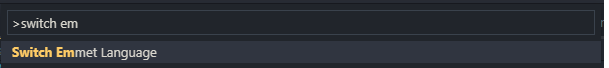
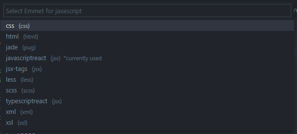
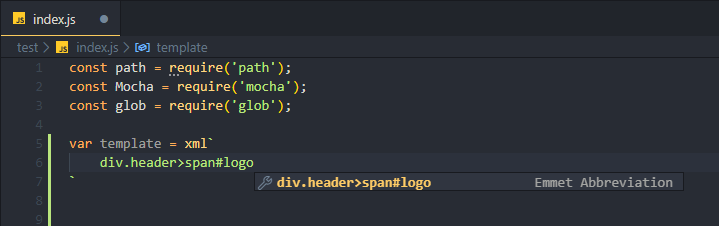
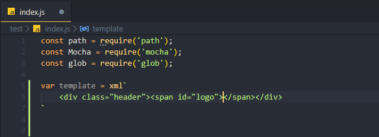

# emmet-switcher README

Allow you to switch the current emmet-mode for programming language of active text editor. 
It is very usefull when you want to support multiple emmet in one file.

## Features

Let say you are working with javascript, and develope 2 templates one for html and css.
Here how to switch between them

* Open your file. This plugin will detect the programming language of your active file.
* <kbd>Ctrl</kbd> + <kbd>Shift</kbd> + <kbd>P</kbd>
* Type `switch emmet` to activate this extension.

* Select one desired language for use by emmet abbreviation.

* press <kbd>Enter</kbd> (or click that item) to apply.

* Lets start writing...

emmet will show the abbreviation.
> Tip: If emmet stop showing abbreviation, pres <kbd>Ctrl</kbd>+<kbd>Space</kbd> to force emmet abbreviation.

* Finally, press <kbd>Tab</kbd> as usually, emmet will do the rest (expand abbreviation)

## Release Notes

### 1.0.0

Initial release of ...

### 1.0.1

Fixed issue #.

### 1.1.0

Added features X, Y, and Z.

-----------------------------------------------------------------------------------------------------------

**Enjoy!**
